 # Create and delete [ Helm chart ]
 helm create backend
 helm install backend-rle backend
 helm upgrade backend-rle backend
 helm uninstall backend-rle
 k get pods --all-namespaces

 alias k=kubectl
 # Manifest and Template 
 helm get manifest backend-rle
 helm get manifest backend-rle > backend-qa-manifest.yaml

 kubectl get namespace qa-namespace -o json > qa-namespace .json
 kubectl patch <resource> <name> -p '{"metadata":{"finalizers":[]}}' --type=merge   
 kubectl patch namespace qa-namespace -p '{"metadata":{"finalizers":[]}}' --type=merge
 kubectl get apiservice
 kubectl delete apiservice apiservice-name

 # Template generation for different environments [Important]*
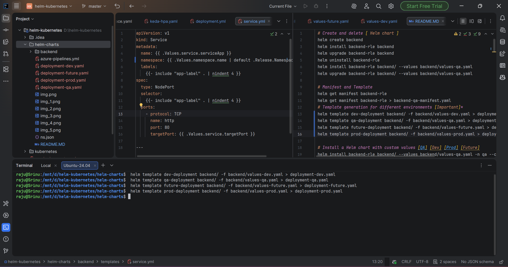 [QA] [Dev] [Prod] [Future]
 # BACK END
 helm template qa-deployment backend/ -f backend/values-qa.yaml > deployment-qa.yaml
 helm template dev-deployment backend/ -f backend/values-dev.yaml > deployment-dev.yaml
 helm template future-deployment backend/ -f backend/values-future.yaml > deployment-future.yaml
 helm template prod-deployment backend/ -f backend/values-prod.yaml > deployment-prod.yaml
 # FRONT END 
 helm template dev-deployment frontend/ -f backend/values-dev.yaml > deployment-dev.yaml
 helm template qa-deployment frontend/ -f backend/values-qa.yaml > deployment-qa.yaml
 helm template future-deployment frontend/ -f backend/values-future.yaml > deployment-future.yaml
 helm template prod-deployment frontend/ -f backend/values-prod.yaml > deployment-prod.yaml

 # Install a Helm chart with custom values [QA] [Dev] [Prod] [Future]=>::
 # QA Environment
 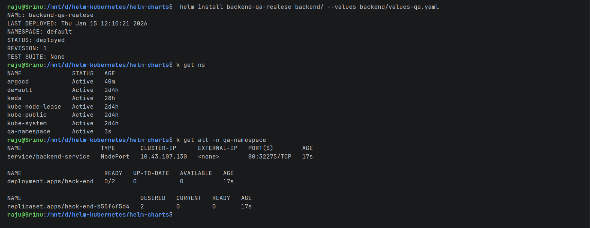
 # Dev Environment
 # Prod Environment
 helm install backend-qa-realese backend/ --values backend/values-qa.yaml
 helm install backend-dev-realese backend/ --values backend/values-dev.yaml
 helm install backend-future-realese backend/ --values backend/values-future.yaml 
 helm install backend-prod-realese backend/ --values backend/values-prod.yaml
 # Upgrade a Helm chart with custom values [QA] [Dev] [Prod] [Future]
 helm upgrade backend-qa-realese backend/ --values backend/values-qa.yaml 
 helm upgrade backend-dev-realese backend/ --values backend/values-dev.yaml  
 helm upgrade backend-prod-realese backend/ --values backend/values-prod.yaml  
 helm upgrade backend-future-realese backend/ --values backend/values-future.yaml  

 # FRONT END DEPLOYMENTS
 helm install frontend-qa-realese front-end/ --values front-end/values-qa.yaml
 helm install frontend-dev-realese frontend/ --values front-end/values-dev.yaml
 helm install frontend-future-realese frontend/ --values frontend/values-future.yaml
 helm install frontend-prod-realese frontend/ --values frontend/values-prod.yaml
 # Upgrade a Helm chart with custom values [QA] [Dev] [Prod] [Future]
 helm upgrade frontend-qa-realese frontend/ --values frontend/values-qa.yaml
 helm upgrade frontend-dev-realese frontend/ --values frontend/values-dev.yaml  
 helm upgrade frontend-prod-realese frontend/ --values frontend/values-prod.yaml  
 helm upgrade frontend-future-realese frontend/ --values frontend/values-future.yaml

 # Verify the deployments
 kubectl get all -n qa-namespace
 kubectl get all -n dev-namespace
 kubectl get all -n future-namespace
 kubectl get all -n prod-namespace
 
 # Uninstall a Helm chart [QA] [Dev] [Prod] [Future]
 helm uninstall backend-qa-realese
 helm uninstall backend-dev-realese
 helm uninstall backend-feture-realese
 helm uninstall backend-prod-realese

 # ConfigMap and Secret Data Reloading Made Simple with Reloader:: -> https://seifrajhi.github.io/blog/reloader-configmap-secret/
 install Reloader using helm:
 -
 # Using Helm
 helm repo add stakater https://stakater.github.io/stakater-charts
 helm repo update
 helm install reloader stakater/reloader # To watch CM/secrets in all namespaces
 helm install reloader stakater/reloader --set reloader.watchGlobally=false --namespace NAMESPACENAME # To watch CM/Secrets in one namespace

 
 # Using Vanilla Manifests
 kubectl apply -f https://raw.githubusercontent.com/stakater/Reloader/master/deployments/kubernetes/reloader.yaml
 kubectl apply -k https://github.com/stakater/Reloader/deployments/kubernetes
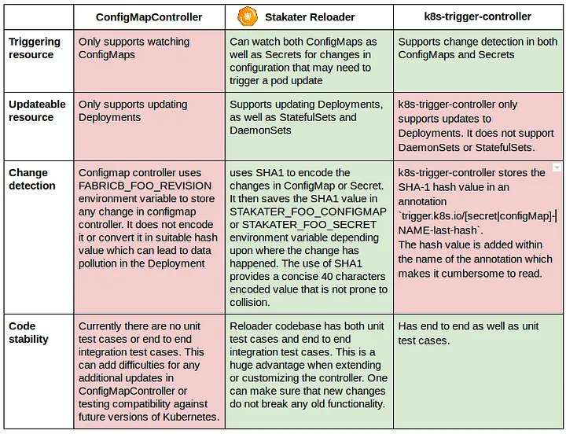
 

 k describe replicaset  back-end-7f974867f6 -n dev-namespace

 # kubernetes objects[ KEDA | svc | ingress | hpa | pvc | pv | cm | secret ]:
 kubectl explain httpscaledobject.spec
 kubectl explain httpscaledobject.spec.scaleTargetRef
 kubectl get crd | grep http

# https://medium.com/@jamesbordane57/haproxy-ingress-controller-kubernetes-installation-configuration-best-practices-e4f4e225989c
# HAProxy Ingress Controller:
# -> is a lightweight, standalone controller that uses HAProxy as the reverse proxy.  It focuses on high-performance L7 routing, SSL termination, and robust TCP/L4 capabilities, with configuration driven by Ingress resources and annotations
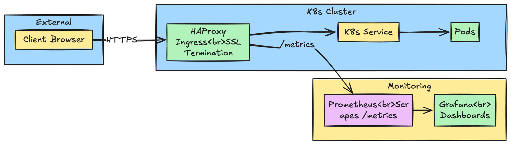
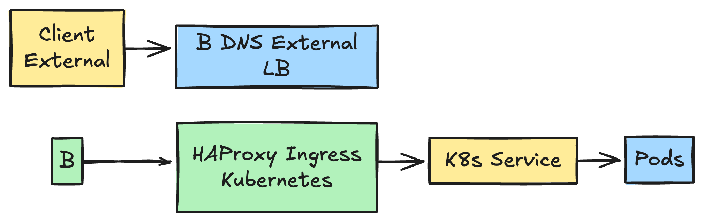

# Option A: Using Helm
helm repo add haproxytech https://haproxytech.github.io/helm-charts
helm repo update
helm install haproxy-kubernetes-ingress haproxytech/kubernetes-ingress --create-namespace --namespace haproxy-controller

# Option B: Using YAML Manifests [ best ]
kubectl apply -f https://raw.githubusercontent.com/haproxytech/kubernetes-ingress/refs/heads/master/deploy/haproxy-ingress.yaml
kubectl get pods --namespace haproxy-controller
kubectl get service --namespace haproxy-controller
curl http://172.16.51.8:30337/ -H 'Host: hello-world.example.com'

# HELM DEPLOYMENT IMAGES
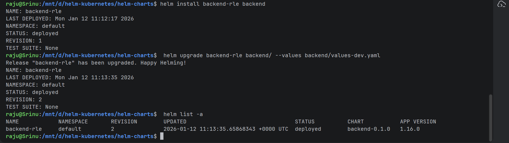

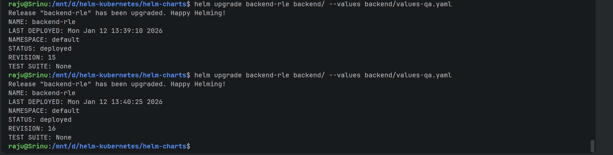
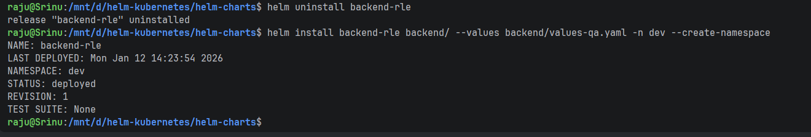
#No Need to specify Namespace while Deleting and Deploying Helm Charts
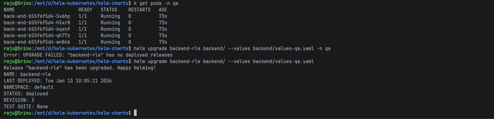

# Kubernetes Objects:
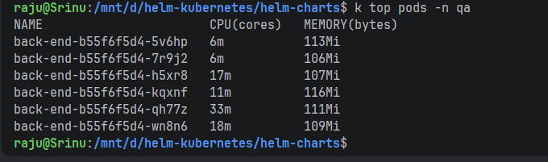
# Before ResourceQuotas [in Qa Namespace]
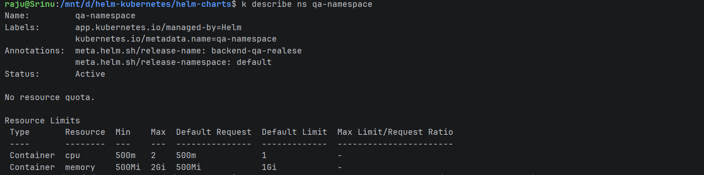
# After ResourceQuotas [in Qa Namespace]
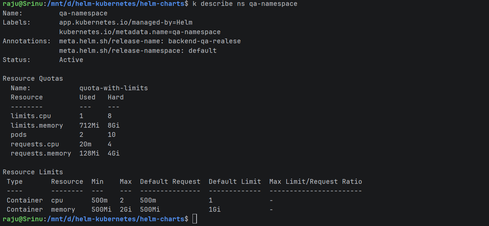

# INGRESS
 -> Cilium: 
 Cilium provides robust, eBPF-based bandwidth management with support for both ingress and egress limits:
 Bandwidth limits are enforced in real-time and apply per pod. Cilium uses EDT (Earliest Departure Time) for egress and eBPF token bucket for ingress.
 Recommended: Use with BPF Host Routing for optimal performance and low latency.

 annotations:
   kubernetes.io/ingress-bandwidth: "20M"
   kubernetes.io/egress-bandwidth: "10M"   

# Calico:
 -> Calico supports fine-grained QoS controls including bandwidth, packet rate, and connection limits.
    Use Calico-specific annotations: qos.projectcalico.org/ingressBandwidth and qos.projectcalico.org/egressBandwidth.
    Supports burst limits and peak rate control. Annotations take effect immediately without pod recreation.
    Note: The Kubernetes-native kubernetes.io/ingress-bandwidth annotations are honored only if Calico's annotations are not present

metadata:
  annotations:
    qos.projectcalico.org/egressBandwidth: "100M"
    qos.projectcalico.org/egressBurst: "200M"   
    nginx.ingress.kubernetes.io/limit-rps: "10"
    nginx.ingress.kubernetes.io/limit-connections: "5"
    nginx.ingress.kubernetes.io/limit-rate: "500"

  
[//]: # (How to Remove Finalizers)
kubectl get namespace backend -o json > ns.json
"finalizers": []
kubectl replace --raw "/api/v1/namespaces/backend/finalize" -f ns.json

[//]: # (Example: Remove finalizer from Pod / PVC)
kubectl patch pvc my-pvc -p '{"metadata":{"finalizers":[]}}' --type=merge

# KEDA HPA Autoscaling
# 🟢 Step 1: Install KEDA core (if not already)
helm repo add kedacore https://kedacore.github.io/charts
helm repo update
helm install keda kedacore/keda -n keda --create-namespace

Verify:
kubectl get pods -n keda
kubectl get crd | grep keda
kubectl get crd | grep http

#🟢 Step 2: Install KEDA HTTP Add-on (THIS IS REQUIRED)
helm install keda-http-addon kedacore/keda-add-ons-http -n keda
kubectl get crd | grep httpscaledobjects

#🟢 Step 3: Confirm API version (important):
kubectl get crd httpscaledobjects.http.keda.sh -o yaml | grep version -A5

🔹 4️⃣ Generate Load
✅ METHOD 1: curl (Simple Test)

for i in {1..500}; do
   curl -H "Host: myhost.com" http://localhost:1199 &
done

✅ METHOD 2: Apache Bench (Recommended)
sudo apt install apache2-utils

ab -n 5000 -c 200 -H "Host: myhost.com" http://localhost:8080/

-n → total requests
-c → concurrent requests

✅ METHOD 3: hey (Best Tool for KEDA HTTP)
sudo snap install hey

hey -n 10000 -c 300 -H "Host: myhost.com" http://localhost:8080

🔹 5️⃣ Watch Autoscaling Live
kubectl get pods -n qa -w
kubectl get httpscaledobject -n qa -w

# Helm kustomization:
Install kustomize:- curl -s "https://raw.githubusercontent.com/kubernetes-sigs/kustomize/master/hack/install_kustomize.sh"  | bash 
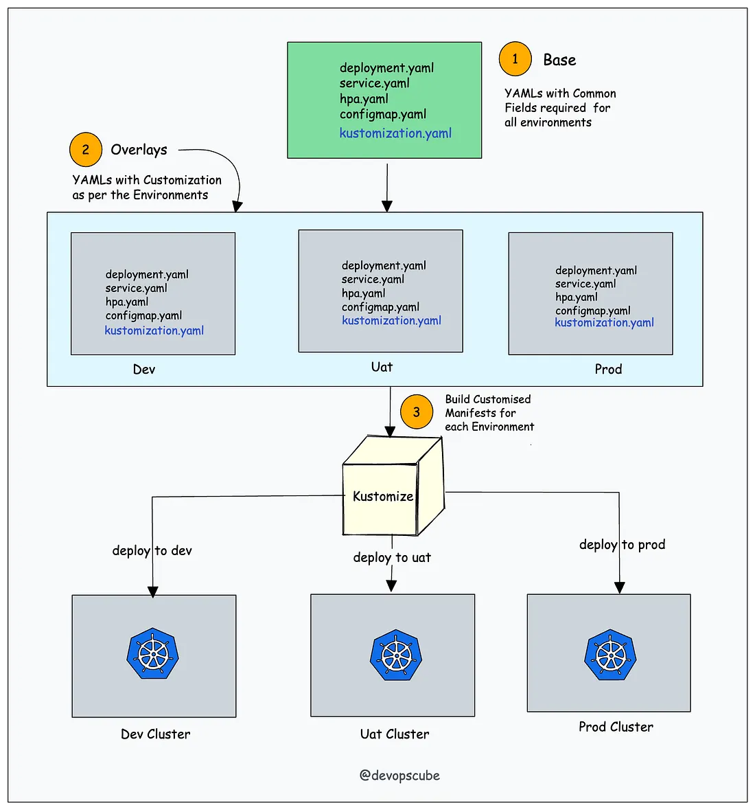

# KUBERNETES AZURE SECRETS ENCRYPTION: -> Create Azure Key-Vault and Secret
-->
az keyvault create — name “aksdemocluster-kv” — resource-group “aksdemo-rg” — location australiaeast
az keyvault secret set — vault-name “aksdemocluster-kv” — name “mysql-password” — value “Test123”

# Enable Secrets Store CSI Driver support
az aks enable-addons --addons azure-keyvault-secrets-provider --name aksdemocluster --resource-group aksdemocluster-rg
# Verify the Secrets Store CSI Driver installation
kubectl get pods -n kube-system -l ‘app in (secrets-store-csi-driver, secrets-store-provider-azure)’
# Verify system-assigned identity on VMs : Verify that your virtual machine scale set or availability set nodes have their own system-assigned identity:
az vmss identity show -g MC_aksdemocluster-rg_aksdemocluster_australiaeast -n aks-agentpool-32528728-vmss -o yaml
az vm identity show -g <resource group> -n <vm name> -o yaml
# Assigns Permissions:->  To grant your identity permissions that enable it to read your key vault and view its contents, run the following commands:
# set policy to access secrets in your key vault
az keyvault set-policy -n <keyvault-name> — secret-permissions get — spn <identity-principal-id>

apiVersion: secrets-store.csi.x-k8s.io/v1
kind: SecretProviderClass
metadata:
  name: azure-keyvault-provider
spec:
  provider: azure
  parameters:
    useVMManagedIdentity: "true"
    usePodIdentity: "false"
    keyvaultName: "my-keyvault"
    objects: |
      array:
        - |
          objectName: "my-secret"
          objectType: secret
          tenantId: "your-tenant-id"
---
# encryption-config.yaml head -c 32 /dev/urandom | base64
apiVersion: apiserver.config.k8s.io/v1
kind: EncryptionConfiguration
resources:
  - resources:
      - secrets
    providers:
      - aescbc:
        keys:
          - name: key1
            secret: <BASE64-ENCODED-32-BYTE-KEY>
      - identity: {}
----

 # Azure storage CSI Dynamic Allocation [ StorageClass | Pvc | PV | Azure Blob Storage ]
 # -> To enable the driver on an existing cluster, include the --enable-blob-driver parameter with the az aks update command as shown in the following example: 
 az aks update --enable-blob-driver --name myAKSCluster --resource-group myResourceGroup
 az aks update

 # PVC → StorageClass → CSI Driver → Cloud Disk/File (Auto)
 # Types Of StorageClasses
 disk.csi.azure.com → Azure Disk == MySQL on Azure Disk
 file.csi.azure.com → Azure File == Frontend on Azure File
 blob.csi.azure.com → Azure Blob == BackEnd on Azure Blob

 # By Default it's Enabled : You can check below CLI Commends
 kubectl get csidrivers
 kubectl get pods -n kube-system | grep csi

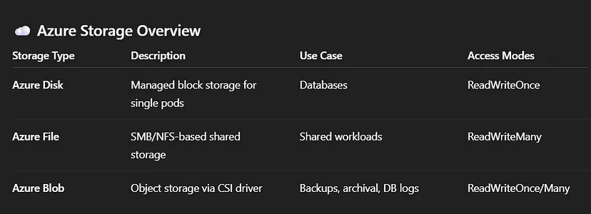
 # Types of Provisioning:
 Static Provisioning: You create PVs manually, and bind PVCs explicitly.
 Dynamic Provisioning: Kubernetes automatically provisions storage using a StorageClass

---
# Cert Manager:
---
apiVersion: cert-manager.io/v1
kind: Certificate
metadata:
  name: wildcard-skanth306-shop
  namespace: argocd
spec:
  secretName: my-wild-card-tls
  renewBefore: 240h
  dnsNames:
  - '*.skanth306.shop'
  - "skanth306.shop"
  issuerRef:
    name: letsencrypt-dns
    kind: ClusterIssuer
---
apiVersion: cert-manager.io/v1
kind: ClusterIssuer
metadata:
  name: letsencrypt-dns
spec:
  acme:
  email: skanth306@gmail.com
  # profile: tlsserver
  server: https://acme-staging-v02.api.letsencrypt.org/directory
  privateKeySecretRef:
     name: letsencrypt-dns-key
# https://github.com/snowdrop/godaddy-webhook
    solvers:
    - selector:
        dnsZones:
        - 'skanth306.shop'
      dns01:
        webhook:
          config:
            apiKeySecretRef:
              key: api-key
              name: godaddy-api-key-secret
            production: false
            ttl: 600
          groupName: acme.skanth306.shop
          solverName: godaddy
# Add a single challenge solver, HTTP01 using nginx
    # - http01:
    #     ingress:
    #       ingressClassName: nginx
---
apiVersion: v1
kind: Secret
metadata:
  name: godaddy-api-key-secret
type: Opaque
stringData:
  api-key: <GODADDY_API_KEY:GODADDY_SECRET_KEY>
---

 # NOTES:
 You do NOT need to create a database Deployment in Kubernetes if you are using a managed database (RDS / Azure SQL / Cloud SQL)

