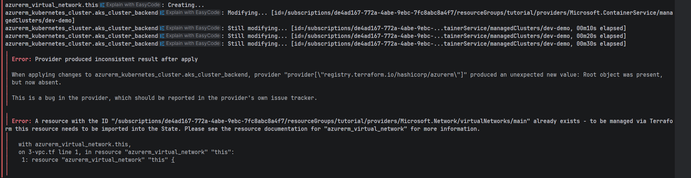
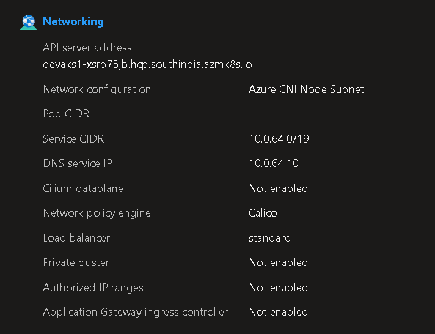
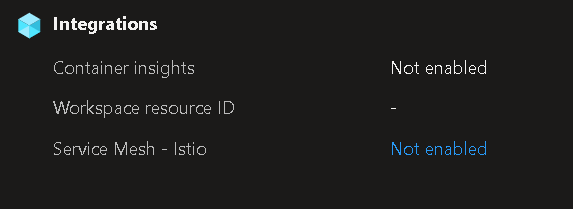
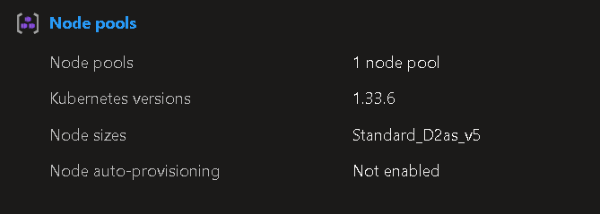
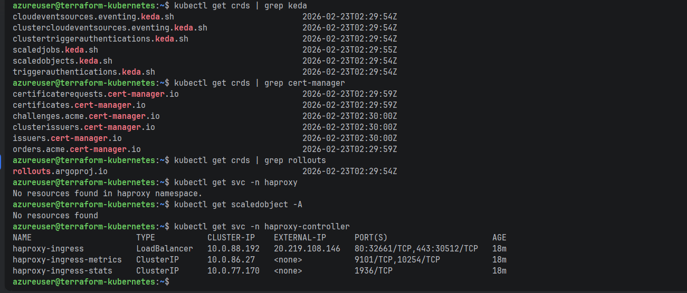

# Azure Kubernetes Service (AKS) Tutorial: (Terraform - Nginx Ingress & TLS - OIDC Workload Identity)

You can find tutorial [here](https://youtu.be/8HmReos6dlY).

## Create AKS cluster using Terraform

```bash
az login
az account list
az account set --subscription <id>
terraform init
terraform apply
az aks get-credentials --resource-group tutorial --name dev-demo
```

## Create Public and Private load balancers

```bash
kubectl apply -f k8s/1-example
kubectl get svc
curl http://<ip>/
```

## Auto-Scaling

```bash
kubectl get nodes
kubectl apply -f k8s/2-example
kubectl get pods
kubectl describe pods nginx-v2-788b5579fd-dmbg8
kubectl get pods
kubectl get nodes
```

## Create an Ingress using Nginx Ingress

```bash
kubectl get svc -n ingress
kubectl apply -f k8s/3-example
kubectl get pods
kubectl get ing
curl --resolve "echo.antonputra.pvt:80:20.96.71.30" http://echo.antonputra.pvt/
```

## Secure the Ingress with TLS & Cert-manager

```bash
kubectl apply -f k8s/4-example
kubectl get pods
kubectl get ing
kubectl get Certificate
kubectl describe Certificate
kubectl describe CertificateRequest
kubectl describe Order
kubectl describe Challenge

kubectl get ing
kubectl get Certificate
dig echo.devopsbyexample.com
kubectl get ing
```

## Test Workload Identity

```bash
kubectl apply -f k8s/5-example
kubectl get pods -n dev
kubectl exec -it azure-cli-c97fd4f7c-rp2mc -n dev -- sh
az login --federated-token "$(cat $AZURE_FEDERATED_TOKEN_FILE)" --service-principal -u $AZURE_CLIENT_ID -t $AZURE_TENANT_ID
az storage blob list -c test --account-name devtest2392919
kubectl delete -f k8s/5-example
```







# Step 1 — verify staging issuer is ready
kubectl get clusterissuer letsencrypt-staging
# READY = True ✅

# Step 2 — check a cert was issued on your ingress
kubectl get certificate -A
kubectl describe certificate <name> -n <namespace>
# "Certificate issued successfully" ✅

# Step 3 — switch your ingress annotation to prod
# cert-manager.io/cluster-issuer: "letsencrypt-prod"

[//]: # (Annotation to use on any Ingress resource:)
# Staging (testing)
annotations:
cert-manager.io/cluster-issuer: "letsencrypt-staging"
haproxy-ingress.github.io/ssl-redirect: "true"

# Production (live)
annotations:
cert-manager.io/cluster-issuer: "letsencrypt-prod"
haproxy-ingress.github.io/ssl-redirect: "true"


# OPTIMIZATION ::

# ✅ Default is 10 — increase it
terraform apply -parallelism=50 --auto-approve
# For large infra
terraform apply -parallelism=100 --auto-approve
# Plan also
terraform plan -parallelism=50

# ✅ Only apply specific resource
terraform apply -target=azurerm_kubernetes_cluster.aks   --auto-approve
terraform apply -target=helm_release.traefik             --auto-approve
terraform apply -target=azurerm_storage_account.storage  --auto-approve

# ✅ Multiple targets [ Use -target — Apply Only What Changed]
terraform apply \
-target=azurerm_resource_group.rg \
-target=azurerm_virtual_network.vnet \
--auto-approve


# ✅ Use Azure Storage backend instead of local
terraform {
backend "azurerm" {
resource_group_name  = "terraform-state-rg"
storage_account_name = "tfstatestorage0208"
container_name       = "tfstate"
key                  = "prod/terraform.tfstate"
}
}